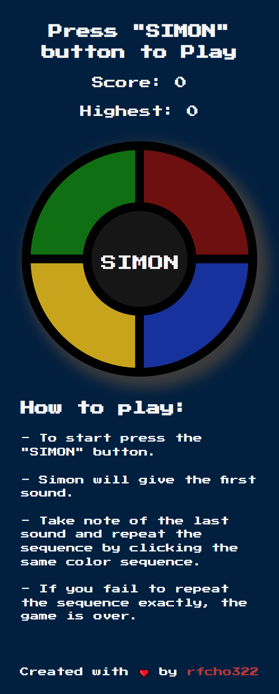

# SIMON GAME

## Table of Contents

- [Overview](#overview)
  - [Screenshot](#screenshot)
  - [Links](#links)
- [How I developed it?](#how-i-developed-it)
  - [Built using](#built-using)
  - [Resources](#resources)
- [Author](#author)

### Overview

- Mobile responsive website
- Scoring feature, get highest score attained.

### Screenshots

  
  

### Links
- Demo website: https://rfcho322.github.io/simon-game/

### How I developed it?

### Built using
- HTML5
- CSS Flexbox
- JQuery

### Resources

- Google Font: https://fonts.google.com/specimen/Press+Start+2P?query=press
- JQuery: https://ajax.googleapis.com/ajax/libs/jquery/3.6.3/jquery.min.js
